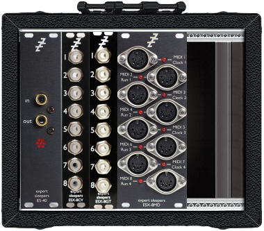
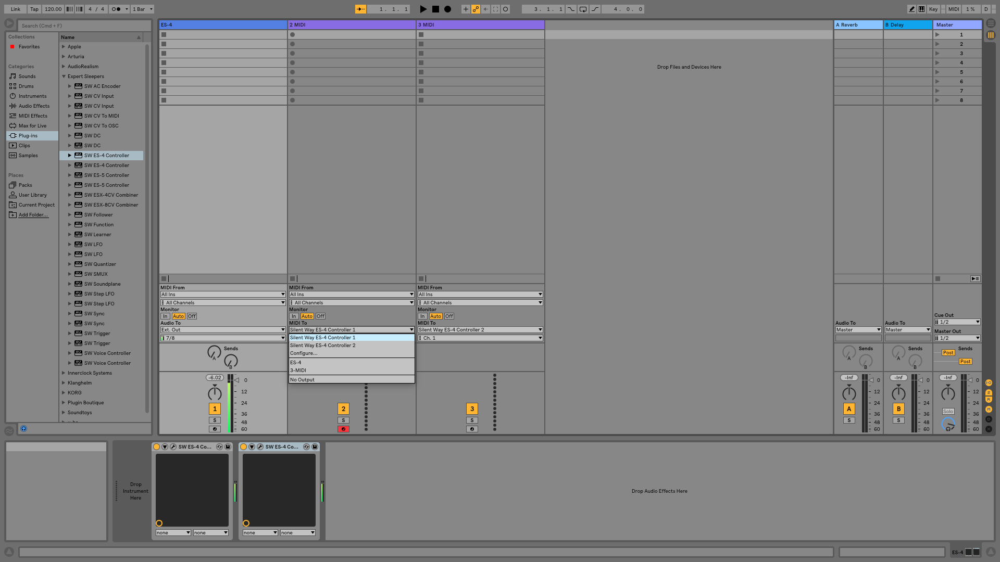
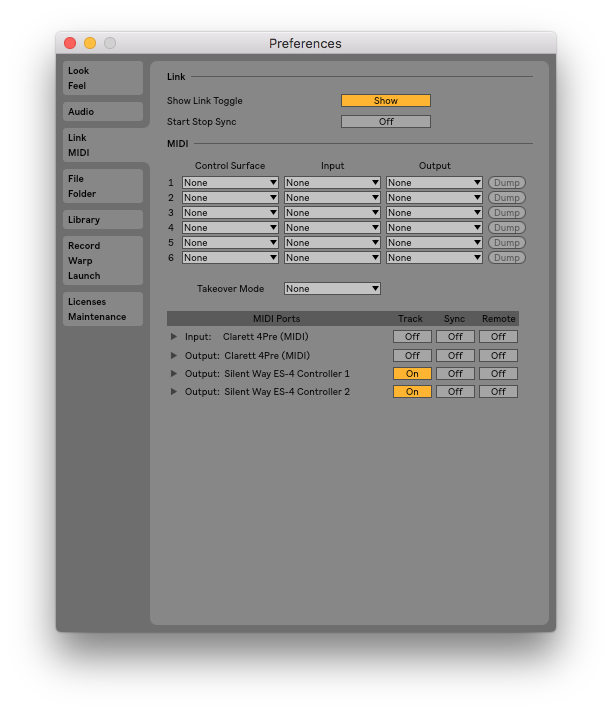
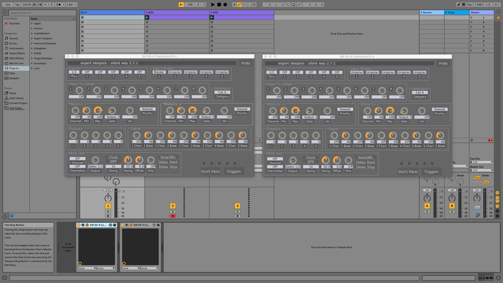
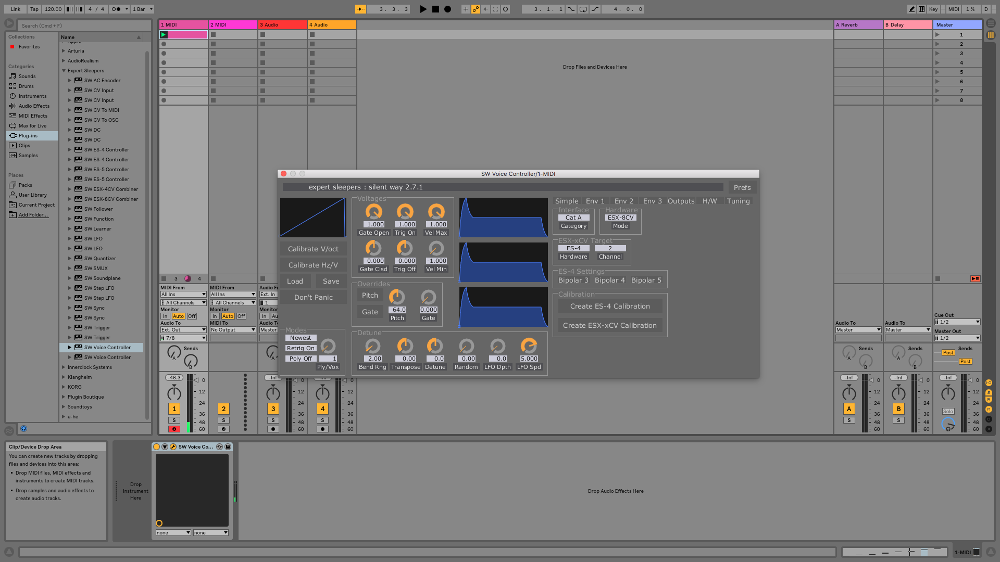
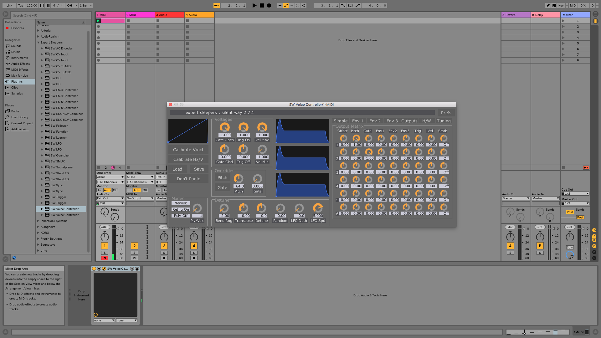
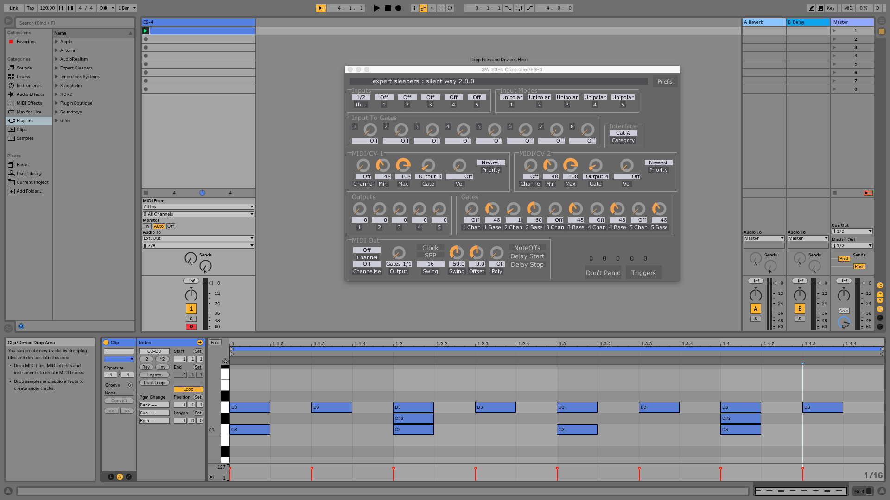

#Expert Sleepers — Silent WAY

##Hardware setup
ES-40 is connected by SPDIF from Claret 4 Pre

SPDIF output channels are 7/8	

ESX-8CV is connected to header 1 of ES-40

ESX-8GT is connected to header 2 of ES-40

ESX-8MD is connected to header 5 of ES-40

##Ableton and ESX-8MD to create multiple MIDI outs

This descripes how to use the ES-40 and an ESX-8MD with Ableton Live for multiple MIDI outs.

Create a new project with one Ableton track for the ‘SW ES4 Controller’ plugins, with an instance for each MIDI instrument (screenshot shows two instances).

In Ableton’s MIDI preferences, turn on each track of the Silent Way ES4 Controller.

Create an Ableton track for each MIDI instrument (no plugin needed) and route the MIDI to ‘Silent Way ES4 Controller 1’ for instrument one, and ‘Silent Way ES4 Controller 2’ for instrument 2.

In each SW ES4 Controller, change the ‘MIDI OUT’ ‘Gate output’ to the correct header of the ES-40relevant MIDI port e.g ‘1/2’ for Header 1 port 2 and in the ‘MIDI/CV’ section change ‘Channel’ to ‘OFF’.

##Ableton and ESX-8CV and to ESX-8GT create multiple pitch CV and GATE outs

This descripes how to use the ES-40 an ESX-8CV and an ESX-8GT with Ableton Live for multiple pitch CV and Gate outs.

Create an audio track ‘ES-40’ and set outputs to 

Calibration

Hardware none

##Ableton and ESX-8CV to create single CV and GATE out

This descripes how to use the ES-40 and an ESX-8CV with Ableton Live for a single pitch CV and Gate out.

Select ‘H/W’ and change ‘HARDWARE’ to ESX-8CV.

In ‘ESX-xCV Target’ select the correct header channel which in this case is 2 (ES-4 hardware is the same as ES-40).

Press ESX-xCV calibration to create a factory calibration file.

In ‘Outputs’ turn off unessecary outputs from the ‘OUTPUT MATRIX’. 

##Ableton and ESX-8GT to create multiple GATE outs

This descripes how to use the ES-40 and an ESX-GT with Ableton Live for trigger outs.

Create a new project with one Ableton track for the ‘SW ES4 Controller’ plugin.

In the SW ES4 Controller, in the ‘MIDI/CV’ section change ‘Channel’ to ‘OFF’, in ‘GATES’ turn ‘3 Chan’ to 1 and ‘3 Base’ to 60.

C3 corresponds to port 1, C3# corresponds to port 2 and D3 corresponds to port 3

